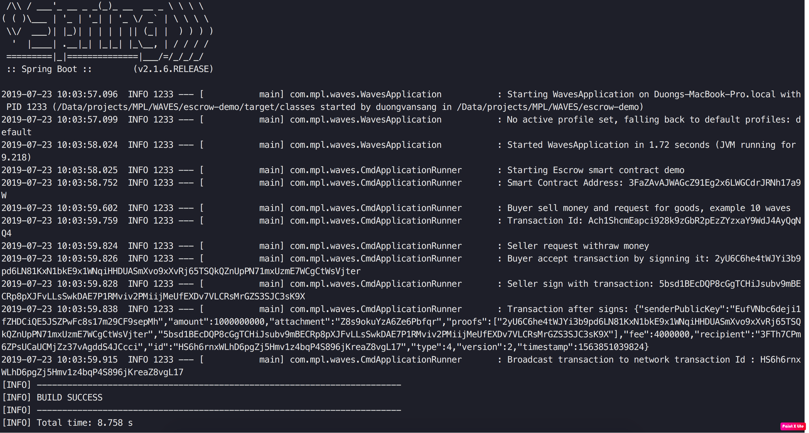

# Waves Escrow dApp sample with waveJ API

https://github.com/Morpheuslabs-io/waves-escrow-dapp-sample

## Overview

This sample dApp is for buying physical goods with cryptocurrencies. 

Should the buyer trust the seller and pay before receiving the goods? Should the seller trust the buyer and ship the goods before receiving payment? This problem can be solved by using a third party escrow service. The problem can be resolved using Waves multisignature feature. 

In the solution, the money is not sent directly to the escrow service’s address, but instead, it is sent to a 2-of-3 multisig address with one key controlled by each of the transacting parties and one controlled by the mediator. When there is no dispute, the two transacting parties can create together the transfer transaction. Only if there is a dispute the mediator will get involved, collaborating with either the buyer or seller (as appropriate) to redeem the funds.

This Escrow sample dApp consists of a Springboot Java program (the dApp client) and a smart contract (a Javascript based smart contract script). The dApp client uses WavesJ API to interact with the Waves smart contract.

The steps below will show how to expore and run the Waves Escrow dApp on Morpheus Labs BPaaS platform (ML BPaaS).

Refer to https://docs.morpheuslabs.io/docs for more detailed information about ML BPaaS.

This video provides a overview about Waves blockchain: https://docs.wavesplatform.com/en/smart-contracts/video-tutorials/introduction-to-the-waves-blockchain-waves-smart-accounts-and-waves-smart-assets.html

Refer to https://docs.wavesplatform.com/en/smart-contracts/writing-dapps.html for Waves smart contract development using Waves IDE.

## Step 1. Create a workspace for the Escrow dApp

You can create a new workspace using "ML-Waves-One" developer stack and a new GitLab repo.

Then start the workspace and open a terminal in CDE, then clone the escrow dapp source code.

`git clone https://github.com/Morpheuslabs-io/waves-escrow-dapp-sample`

Alternatively, you can directly create a workspace using the escrow repo in GitLab then start from step 2, or you can download the Escrow dapp from the App Library on ML BAppS, then create a workspace using the escrow app downloaded, and then start from step 2. To do these, you may need to be familiar with ML BPaaS.

## Step 2. Configure Ride IDE

### Open Ride IDE

Open a server tab in the terminal, then click on waves-ide link to open Ride IDE


### Prepare Accounts to run the dApp

Prepare the following accounts to run the dapp:

- Use the existing genesis account in your private waves node on ML BPaaS as the buyer account.
- Use the existing seller account (a constant seed value) in the application.properties file.
- Create a new account using Ride IDE as the escrow account that will be used to run the escrow smart contract.

The escrwo account will be used to attach dapp scripts to it to provide escrow service. You can generate it, by clicking "Add Account", then "Generate new account" in Ride IDE.


After creating the account, there is no any waves token yet in the account. We will send some waves tokens to the account from the genesis account later.


### Retrieve Info of Genesis Account

Then, Open Waves private network from BlockChain Ops on ML BPaaS and click on retrieve button to get genesis account info, copy "seed" info for later usage.


### Connect Ride IDE to Private Waves Node on ML BPaaS

Next, lets configure Ride IDE to connect to a Waves private network on ML BPaaS. Click on setting icon, you can see a custom node has been automatically created, just ensure it is the default node for the Waves IDE as seen in the diagram below.


## Step 3. Send Waves token

Now we send some waves token from the generis account to the new account that we just created. Unfortunately, Waves does not provide wallet for development network yet, so we need to use Ride Console with javascript to do it.

```javascript
// the seed you just copy above
const seed = "FwGv7haZrYD5vNSmhYbmBg76fhyGCTatObCKiR3lxnHQVbA9EouYA0Hq4pLNmw7heFbwSJqe9H24uv3XFoID19JWsn8A6Wc2daMo"

// let define transaction object with 10 waves, we send from genesis account 
// recipient is your account address
// amount is total waves toekn that to send = waves*10^8
const txo = {
"type":4,
"senderPublicKey":"AGRAhCD5rJUQDG6mE54voaE4et8bdRu6kAenyfPyM6SB",
"recipient":'3FQ5tmDWAnQkkMNeWy8gYPBBqGy3XUSM7aE', 
"amount": 1000000000 
};

// sign transaction with seed
const signedTx = transfer(txo, seed);

// broadcast transaction to network
const result = await broadcast(signedTx)
"transactionId: "+result.id

```

Replace the value of "recipient" with your newly created account address, then copy and paste the codes to Ride console, and then Enter to run the script. Note that you may need to type a space in order to show the result of running the script. This may be a bug in this version of the Waves IDE.

After running the codes, you will get a transaction Id as shown in the screenshot below. Wait for a while to see the waves token available in your account.


## Step 4. Deploy dAppp Script (smart contract)

Now we will deploy the escrow dapp script using the newly created account in the Waves IDE.

The below is the smart contract script that is used to set the rules of multisig. We are using existing accounts for buyer and seller in this sample, and we will try to use buyer and seller to sign the transaction, so there is no change to the script is required to deploy and run it in this sample.

```
let buyerPubKey  = base58'AGRAhCD5rJUQDG6mE54voaE4et8bdRu6kAenyfPyM6SB';
let sellerPubKey = base58'3aRpjNJvuSodTHFwTAUvWfFxtyp4N2UJqbh2baigr2Dx';
let escrowPubKey = base58'HtCXHUxdDgZvm24mkKvHymB6aRBNwgwAAYUhaAaG1yXL';
let buyerSigned = if(sigVerify(tx.bodyBytes, tx.proofs[0], buyerPubKey)) then 1 else 0;
let sellerSigned = if(sigVerify(tx.bodyBytes, tx.proofs[1], sellerPubKey)) then 1 else 0;
let escrowSigned = if(sigVerify(tx.bodyBytes, tx.proofs[2], escrowPubKey)) then 1 else 0;

buyerSigned + sellerSigned + escrowSigned >= 2
```

- Create dapp script by clicking on (+) icon and select dapp script
- Open the file `src/main/resources/script.ride` (smart contract script) in CDE and copy / paste it to Ride IDE
- Click on Deploy Account Script button
- Click Add sign button to sign the transaction
- And then click on publish button to deploy the script (smart contract)


After the deployment, you can open the Waves explorer (from your Waves private network on ML BPaaS) to confirm if the script has been attached to the account. 0.01 waves has been deducted from your account that has been used for the deployment of the smart contract and a transaction has been recorded in a block.


## Step 5. Integrate with smart contract with WaveJ API

See how to have a Springboot based Java applicaiton to interact with Waves smart contracts.

### Exploer the Java application

Open the workspace that contrains the Escrow dApp and use the CDE to exploer the Java application.

### Update configuration

From the CDE, open the Springboot configuration file `src\main\resources\application.properties`, then update the following:

- Update NODE_URL field to the internal url of your Waves private node on ML BPaaS
- Update SMART_ACCOUNT_PUBLIC_KEY to the public key of the newly created account (escrow account)

```
#Configuration
# Network url
NODE_URL=http://bops-t.morpheuslabs.io:27877
#main net W, testnet T, custom net D
NETWORK_BYTE=D


#smart contract account
SMART_ACCOUNT_PUBLIC_KEY=G9SxW9UEnh37L4yQmwcQJrJx1ehdZCdR6LrMJG2TNjVK
```

Note that seeds for BUYER and SELLER have already been configured in the property file to use the genesis account for the buyer and an existing account for the seller, so no change is required. As per the default logic in the dApp client code, only the buyer and the sellet need to sign a transaction, so escrow is not required to sign the signature, so the escrow SEED value is ignore and no change it required. Now you can go to the next step to run the dApp client.

You could get ESCROW_SEED from the account you generated at step 2 to update it in application.properties file. For Seller SEED, you can just generate another new account and get the seed and then update it in application.properties file also.

You only need to update the SEED info in the property file, if you are using different accounts for the buyer, the seller, or you want the escrow to sign the transaction as well.


## Step 6. Run Escrow dApp

Open a terminal in the CDE to run the application.

```
cd /projects/waves-escrow-dapp-sample
mvn clean spring-boot:run
```
It may take few minutes for maven to download the dependencies to run the springboot java app.

From the Ride IDE, you can import Buyer and Seller accounts using their seed phrases in the application.properties file. In Account of Ride IDE, you can scrow down to see the list of all the accounts.

You can see the output as below, then check the seller account, you will see more waves has been transferred to the buyer account.



From the java code, you can see that withdraw transaction needs to be signed by both buyer and seller, if there is only one signature, the transaction would not be done.

```java

    LOG.info("Seller request withraw money");
    Transaction tx1 = Transaction.makeTransferTx(smartAccount, sellerAddress, 1000000000,"WAVES", fee * 4 ,"WAVES", "Sending Money");

    //Buyer and Seller sign the deal with proofs
    String buyerSig =  buyer.sign(tx1);
    LOG.info("Buyer accept transaction by signning it: {}", buyerSig);
    
    String sellerSig =  seller.sign(tx1);
    LOG.info("Seller sign with transaction: {}", sellerSig);
    tx1 = tx1.withProof(0, buyerSig);
    tx1 = tx1.withProof(1, sellerSig);
```

You could also use escrow account to sign transaction for seller's transaction also with small change in code.

```java
// create escrow account from seed
PrivateKeyAccount escrow = PrivateKeyAccount.fromSeed(ESCROW_SEED,0, (byte)NETWORK_BYTE);

// sign transaction
String escrowSig =  escrow.sign(tx1);
tx1 = tx1.withProof(2, escrowSig);

// final broadcast transaction to network
node.send(tx1);

```

